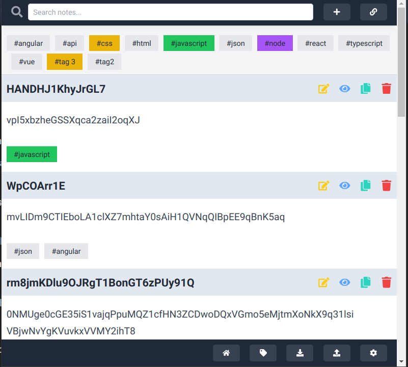
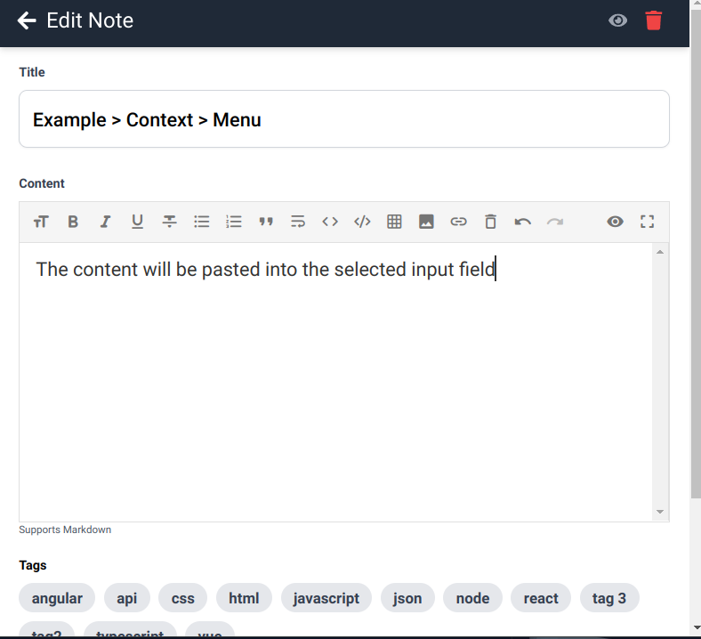

# Notes Chrome Extension

## Overview

This Chrome extension enhances your note-taking experience by supporting Markdown and providing a rich text editor. With a focus on flexibility and user customization, the extension allows you to organize and manage notes efficiently using tags, context menus, and other advanced features.

## Features

### Markdown Support with Rich Text Editor
- **Markdown Syntax**: Write and format your notes using Markdown, with support for all common Markdown features.
- **Rich Text Editor**: A built-in rich text editor provides an intuitive interface for editing your notes.

### Tags with Color Coding
- **Custom Tags**: Organize your notes with tags, each of which can be assigned a specific color for easy identification.
- **Context Menus**: Create context menus using 'context' as a tag. Context nesting can be achieved by using the '>' separator.
- **Dynamic Pasting**: Anything under a note will be pasted into the selected input when invoking the context menu.

### Note Filtering and Pagination
- **Text and Tag Filtering**: Quickly find notes by filtering them through text or tags.
- **Pagination Support**: Handle large numbers of notes with ease by navigating through pages. The extension supports pagination to ensure smooth performance and usability.
- **Persistent State**: The previous page can be retained between sessions by enabling the persist state option in the settings.
- **Configurable Page Display**: Adjust the number of pages displayed per screen in the settings for a customized experience.

### Import and Export
- **Export Notes**: Easily export your notes as a JSON file to back them up or transfer them to another device.
- **Import Notes**: Import notes from a JSON file to restore a backup or load notes from another source.

### Secure and Local Storage
- **Chrome Local Storage**: All your notes and settings are stored locally within your browser using Chrome’s local storage. No data is shared through the cloud, providing enhanced security and privacy for your work.

## Settings
- **Persist State**: Enable this option to retain the previous page when you reopen the extension.
- **Notes Per Page**: Configure the number of notes displayed per page to suit your workflow.

## Security
The extension leverages Chrome's local storage, ensuring that all your data remains on your device. This approach provides greater security by preventing any data from being shared or stored on external servers.

## How to Use
1. **Creating Notes**: Open the extension and start creating notes using the Markdown editor.
2. **Tagging Notes**: Add tags to your notes for easy organization. Tags can be customized with colors.
3. **Using Context Menus**: Assign context menus to tags using 'context' as a tag and nest them with '>' if needed.
4. **Filtering Notes**: Use the search bar to filter notes by text or tags.
5. **Managing Pagination**: Navigate through large sets of notes using the pagination controls. Adjust the number of notes per page in settings.
6. **Persisting State**: Enable the persist state option in settings to remember the last page you were on.
7. **Exporting Notes**: Save your notes as a JSON file to back them up or transfer them.
8. **Importing Notes**: Restore notes by importing a JSON file into the extension.

## Screenshots

- **Main Window**: 
- **Example Context Menu Entry**: 

## Developer Notes

This extension is developed using [crxjs](https://crxjs.dev/vite-plugin) and the Vite.js plugin, with Tailwind CSS. To get started with the development environment, use the following commands:

```bash
pnpm i
pnpm dev
```

This extension is designed to make your note-taking more organized, secure, and efficient.